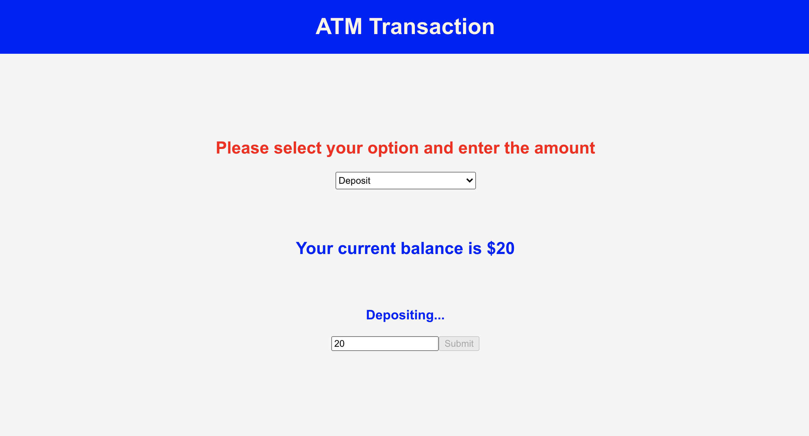

# ATM transaction
 It will perform a simple ATM transaction of deposit and withdraw.

**What I Learned**
- How to create a react application
- How to use ES6 features
- How to use functions with hooks to handle states in components
- How to deploy a react project in github

**todo list**

## Description
- We can do two transactions using this ATM app.
- One is deposit and the other one is withdraw.
- Any non-negative amount can be deposited by choosing a deposit option from the select menu.
- Any non-negative amount which is less than the current balance amount can be withdrawn.
- Whenever a valid transaction(deposit / withdraw) happens the balance amount will be updated.
- Whenever the user enters negative amount / try to withdraw more than the balance / not choosing the options
  the user will be informed about what was wrong in their action.
   

## Installation
- Download this project in your working directory through, \
git clone https://github.com/vanisbala/react-atm
- cd into the new folder and type
$ npm install
it will install the required dependencies.
- To run the react project
$ npm start
- You can add new actions are delete the existing actions in the list.
- You can also modify the project to include new features.

**Demo**

## Built with
- [HTML](https://developer.mozilla.org/en-US/docs/Web/HTML)
- [CSS](https://developer.mozilla.org/en-US/docs/Web/CSS)
- [JavaScript](https://developer.mozilla.org/en-US/docs/Web/Javascript)
- [React](https://reactjs.org/)

## Deployed Link
- [See live Site](https://vanisbala.github.io/react-atm/)

## Author
### Vani 
- [Link to Github](https://github.com/vanisbala)

## Credits
Thanks to MITxPRO for giving me the opportunity to work on this simple react project.

**Tutorials**
- [React hooks](https://reactjs.org/docs/hooks-intro.html)

